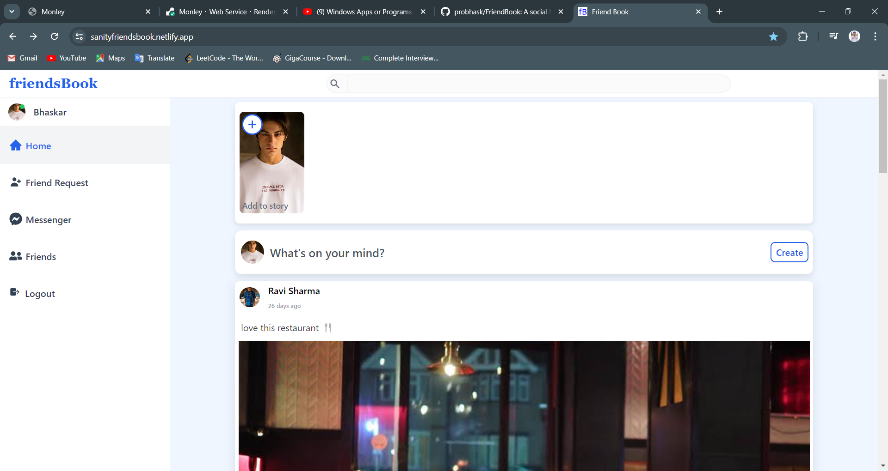
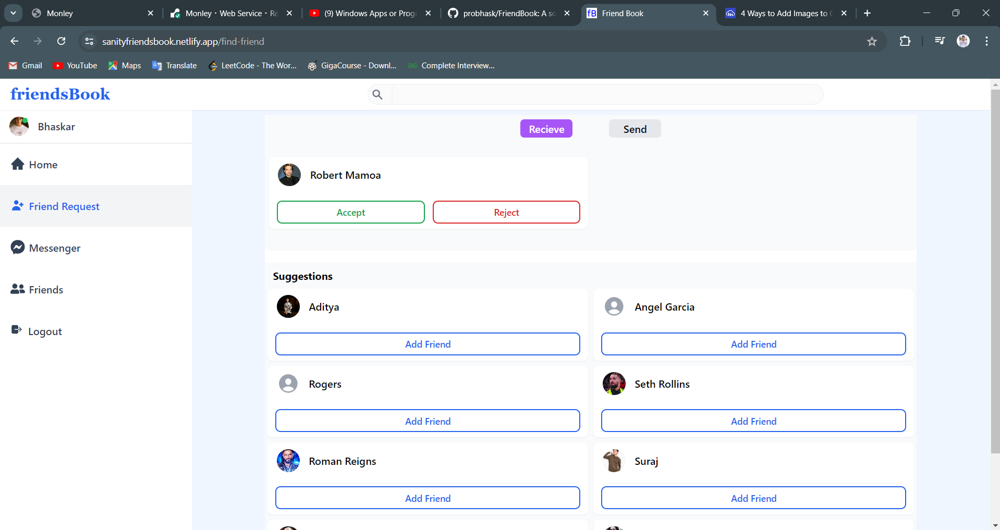
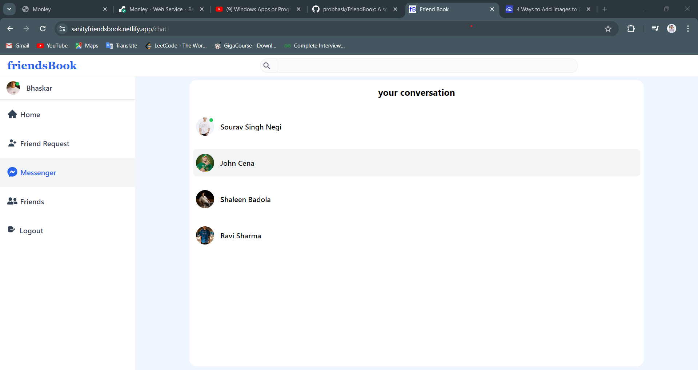

# FriendBook Project Report

FriendBook is a social media platform designed to allow users to connect, share posts, and interact with friends. This report details the structure, technologies used, and optimization techniques applied to both the frontend and backend of the project.

- Project is deployed on netlify
  [Website Link 🔗](https://sanityfriendsbook.netlify.app)

```bash
https://sanityfriendsbook.netlify.app
```



## Frontend Overview (src Folder)

### Folder Structure

The src directory is organized into multiple subdirectories, each serving a specific purpose:

- **api/**: API call functions.
- **assets/**: Static assets like images.
- **components/**: Reusable UI components (e.g., Feed, Menu,Profile)
- **constants/**: Configuration settings and constants.
- **container/**: Manages complex components or sections.
- **features/**: Organized by app features (e.g., FindFriends, Stories, Profile).
- **hooks/**: Custom React hooks (e.g., useDebounce, useInfiniteScroll).
- **pages/**: Main page components (e.g., Home, Profile, Login, Register).
- **redux/**: Redux state management (slices and async functions).
- **Routes/**: : Application routing definitions..
- **types/**: TTypeScript types and interfaces.
- **utils/**: Utility functions (e.g., date formatting, error handling).

### Technologies Used

1. **React**: Main framework for the useTypeScript.
2. **TypeScript**: Static type checking.
3. **Tailwind CSS**: Utility-first CSS Framework.
4. **Redux Toolkit**: State management.
5. **Sanity.io**: Content management and media storage.
6. **React Router**: Navigation and routing.

### Optimization Techniques

1. **Code Splitting**: Dynamically imported components
2. **Custom Hooks**: Performance optimization (e.g., `useDebounce`, `useInfiniteScroll`).

3. **Error Boundaries**: Prevents crashes from JavaScript errors.
4. **Responsive Design**: Tailwind CSS for adaptable layouts.
5. **Memoization**: `useMemo` and `useCallback` for performance.
6. **Lazy Loading**: Deferred component loading.
7. **Shimmer Effect**: Loading placeholders for perceived performance.
8. **Protected Routes**: Secured routing for authenticated users.

## Backend Overview (`schemaTypes` Folder)

### Folder Structure

The schemaTypes directory defines data models for the backend comment.tso:

- **comment.ts**Comment schema.
- **conversation.ts**: Conversation schema.
- **friendRequest.ts**: Friend request schema.
- **friends.ts**: Friends schema.
- **index.ts**: Entry point for exporting schemas.
- **like.ts**: Like schema.
- **message.ts**: Message schema.
- **posts.ts**: Post schema.
- **stories.ts**: Story schema.
- **user.ts**: User profile schema

### Technologies Used

1. **Sanity.io**: Headless CMS for content management.
2. **TypeScript**: Type safety and improved developer experience.

### Data Models Overview

1. **User Model (user.ts)**: Manages user profiles.
2. **Post Model (posts.ts)**: Comment Model (comment.ts)posts.
3. **Comment Model (comment.ts)**: Manages user comments.
4. **Like Model (`like.ts`)**: Tracks likes on posts and comments.
5. **Story Model (`stories.ts`)**: Defines ephemeral content (Stories).
6. **Friend Request Model (`friendRequest.ts`)**: Manages friend requests.
7. **Friend Model (friends.ts)**: Tracks friendships between users.
8. **Conversation Model (conversation.ts)**: Defines private conversations.
9. **Message Model (message.ts)**: Manages individual messages.

#### HOME


#### Friends Request



#### Messenger



## Summary

The FriendBook project is a comprehensive social media platform that leverages modern web development practices and technologies. The frontend is built with React, TypeScript, and Redux, focusing on performance and scalability. The backend, managed with Sanity.io, defines robust data models to handle user-generated content, social interactions, and more. Together, these components create a scalable and efficient platform for social networking.

---
